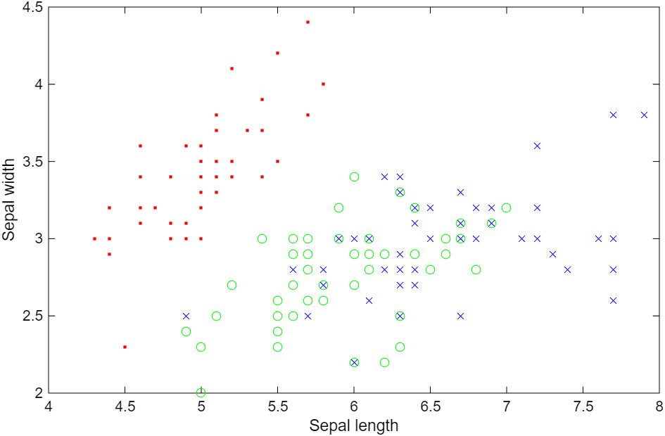
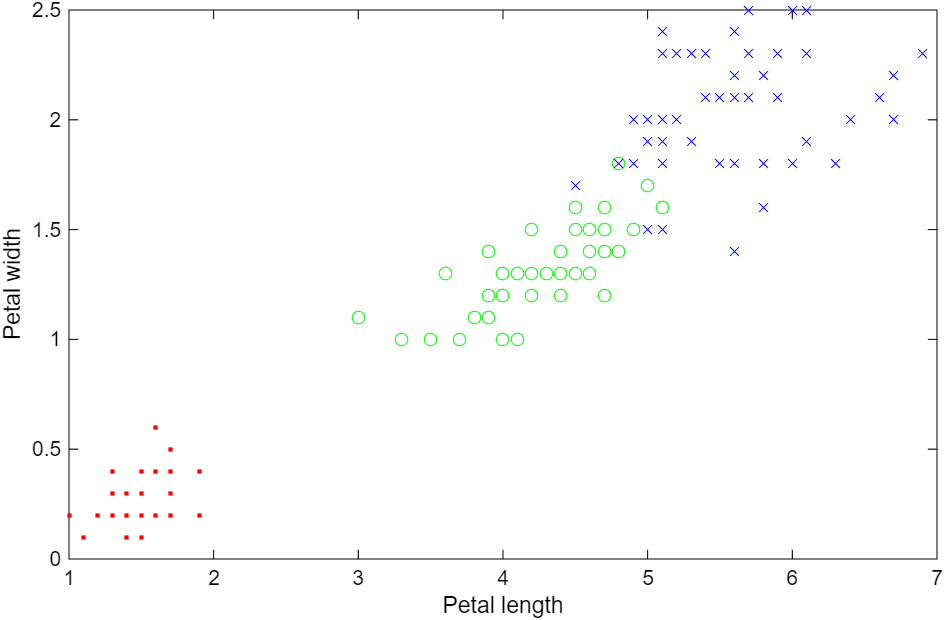
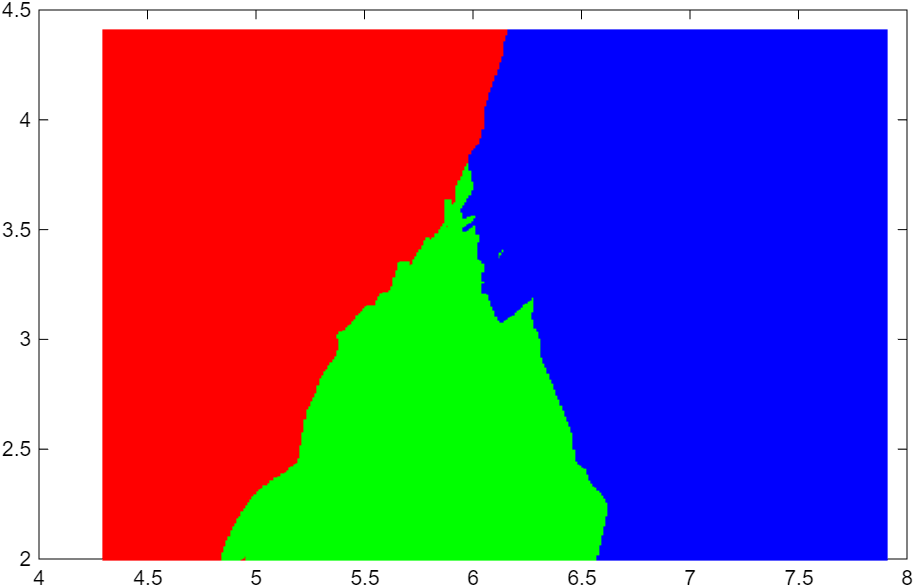

# 인공지능개론

MATLAB R2025b + Statistics and Machine Learning Toolbox 사용

> **HW3 (KNN 실습)** : `ex1_dataload_visualization.m` ~ `ex5_knn_space.m` 5개 파일. 아래 3주차 표 참고

## 2주차 - MATLAB 기초

- `practice1.m` : 행렬 인덱싱, zeros/ones/length, plot/stem/bar, subplot, find 연습
- `HW1.m` : 키-몸무게 데이터로 `Weight = 0.2*Height + 30` 을 행렬곱으로 표현. Height 6x2 (2열은 ones), `t = [0.2; 30]` 으로 `Height*t` 하면 Weight가 나오는지 확인. 차이가 전부 0 나옴

## 3주차 - kNN (k-Nearest Neighbor)

iris 데이터 (150개, 특징 4개, 3종) 로 실습

| 파일 | 내용 |
|---|---|
| ex1_dataload_visualization.m | fisheriris 불러오기, 종별로 색 다르게 그리기, species를 숫자로 바꾸기, 학습/평가 데이터 나누기 |
| ex2_knn_using_matlab.m | fitcknn + predict 로 kNN. k=3, sepal length/width 2개 특징, versicolor vs virginica |
| ex3_knn_my_style.m | kNN 직접 구현. for문으로 거리 계산 -> sort -> k개 -> mode로 다수결. fitcknn 결과랑 비교 |
| ex4_knn_generalization.m | 3종 전부, 특징 4개로 확장. k=5 |
| ex5_knn_space.m | meshgrid로 평면 전체를 분류해서 결정 경계 그려보기. k=50 |

  
  

왼쪽 sepal, 오른쪽 petal. 빨강 setosa · 초록 versicolor · 파랑 virginica. sepal만 보면 초록과 파랑이 겹쳐 있고, petal로 보면 세 종이 거의 나뉜다 — ex2·ex3이 60%에 그치고 ex4가 98.3%로 뛰는 이유가 여기 있다.

### 결과

- ex2, ex3: 정확도 24/40 (60%). sepal만 쓰면 versicolor랑 virginica가 많이 겹쳐서 잘 안 나뉨
- ex3 직접 구현이랑 fitcknn 결과 완전히 똑같음
- ex4: 59/60 (98.3%). petal 특징까지 넣으니까 확 올라감
- ex5: 빨강(setosa)/초록(versicolor)/파랑(virginica) 세 영역으로 나뉘는 게 보임

  

ex5 — sepal 평면 130,321개 격자점을 전부 분류해 그린 결정 경계 (k=50)

### 정리

- 학습 데이터로 평가하면 안 됨. 학습 60개 / 평가 40개로 나눔
- kNN은 학습이 따로 없고 (데이터 저장이 끝) 분류할 때마다 전체 거리 계산해서 분류가 느림
- k는 홀수로 (동점 방지). 3종일 때는 동점 날 수 있어서 fitcknn은 BreakTies 옵션으로 처리, mode()는 작은 값 반환
- 거리는 유클리디안(L2) 씀. L1(맨해튼)도 있음
